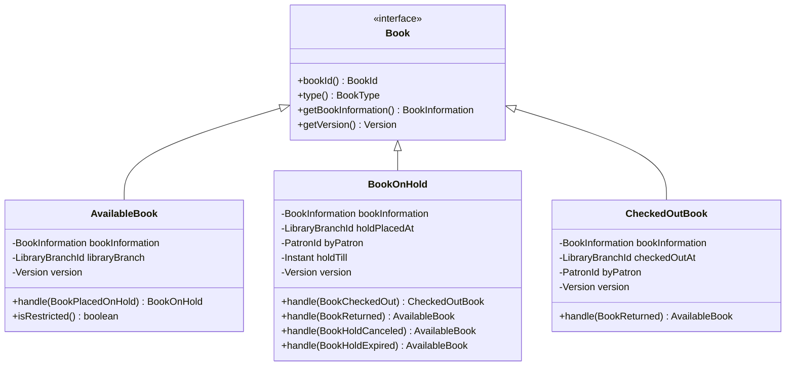
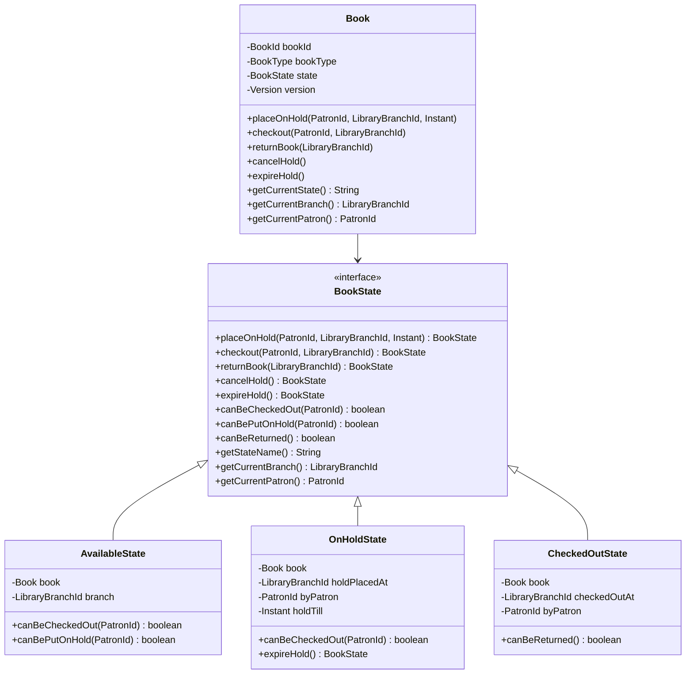
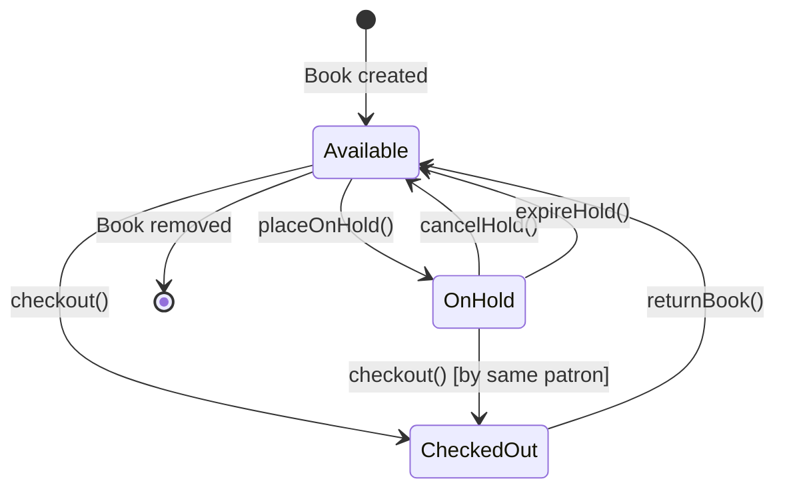

# Library System Migration Guide: From Class-per-State to State Pattern

## Table of Contents
1. [Executive Summary](#executive-summary)
2. [Architectural Overview](#architectural-overview)
3. [Pattern Comparison](#pattern-comparison)
4. [State Transition Analysis](#state-transition-analysis)
5. [Code Examples](#code-examples)
6. [Migration Benefits and Trade-offs](#migration-benefits-and-trade-offs)
7. [Migration Checklist](#migration-checklist)
8. [Testing Strategies](#testing-strategies)
9. [Performance and Thread Safety](#performance-and-thread-safety)
10. [Troubleshooting Guide](#troubleshooting-guide)

## Executive Summary

This guide documents the migration from a **class-per-state pattern** to the **State pattern** in the library lending system. The migration transforms the book state management from separate classes (`AvailableBook`, `BookOnHold`, `CheckedOutBook`) to a unified `Book` class that delegates behavior to `BookState` implementations.

### Key Changes
- **Old Model**: Event-driven state transitions using `handle()` methods
- **New Model**: Direct state transitions with explicit validation
- **Repository Interface**: Remains unchanged, ensuring good abstraction
- **Version Management**: Centralized in the unified `Book` class

## Architectural Overview

### Old Model Architecture (Class-per-State)



### New Model Architecture (State Pattern)



## Pattern Comparison

| Aspect | Old Model (Class-per-State) | New Model (State Pattern) |
|--------|----------------------------|---------------------------|
| **State Representation** | Separate classes for each state | Single Book class with state delegation |
| **State Transitions** | Event-driven `handle()` methods | Direct method calls with validation |
| **Version Management** | Distributed across state classes | Centralized in Book class |
| **Validation** | Implicit through event handling | Explicit through `can*()` methods |
| **Memory Usage** | New object per state transition | State object reuse possible |
| **Type Safety** | Compile-time state type checking | Runtime state validation |
| **Extensibility** | Add new state class | Add new state implementation |

## State Transition Analysis

### State Transition Diagram



### Transition Rules

#### Available State
- **Can transition to**: OnHold, CheckedOut
- **Validation**: Always allows hold placement and checkout
- **Invalid operations**: return, cancel hold, expire hold

#### OnHold State
- **Can transition to**: Available, CheckedOut
- **Validation**: Only patron who placed hold can checkout
- **Business rules**: Hold expiration based on `holdTill` timestamp

#### CheckedOut State
- **Can transition to**: Available
- **Validation**: Only allows return operation
- **Invalid operations**: place hold, checkout, cancel/expire hold

## Code Examples

### State Transitions: Old vs New

#### Old Model - Event-Driven Transitions

```java
// Placing a book on hold (old model)
public class AvailableBook implements Book {
    public BookOnHold handle(BookPlacedOnHold bookPlacedOnHold) {
        return new BookOnHold(
                bookInformation,
                new LibraryBranchId(bookPlacedOnHold.getLibraryBranchId()),
                new PatronId(bookPlacedOnHold.getPatronId()),
                bookPlacedOnHold.getHoldTill(),
                version);
    }
}

// Checking out from hold (old model)
public class BookOnHold implements Book {
    public CheckedOutBook handle(BookCheckedOut bookCheckedOut) {
        return new CheckedOutBook(
                bookInformation,
                new LibraryBranchId(bookCheckedOut.getLibraryBranchId()),
                new PatronId(bookCheckedOut.getPatronId()),
                version);
    }
}
```

#### New Model - Direct State Transitions

```java
// Placing a book on hold (new model)
public class Book {
    public void placeOnHold(PatronId patronId, LibraryBranchId branchId, Instant holdTill) {
        if (state.canBePutOnHold(patronId)) {
            state = state.placeOnHold(patronId, branchId, holdTill);
            version = version.next();
        }
    }
    
    public void checkout(PatronId patronId, LibraryBranchId branchId) {
        if (state.canBeCheckedOut(patronId)) {
            state = state.checkout(patronId, branchId);
            version = version.next();
        }
    }
}

// State-specific validation
public class OnHoldState implements BookState {
    @Override
    public boolean canBeCheckedOut(PatronId patronId) {
        return patronId.equals(byPatron);
    }
    
    @Override
    public BookState checkout(PatronId patronId, LibraryBranchId branchId) {
        if (!patronId.equals(byPatron)) {
            return invalidTransition("Only the patron who placed the hold can check out the book");
        }
        return new CheckedOutState(book, branchId, patronId);
    }
}
```

### Version Management Comparison

#### Old Model - Distributed Version Handling
```java
// Each state class manages its own version
public class BookOnHold implements Book {
    private final Version version;
    
    public AvailableBook handle(BookReturned bookReturned) {
        return new AvailableBook(bookInformation, 
                                new LibraryBranchId(bookReturned.getLibraryBranchId()),
                                version); // Version passed but not incremented
    }
}
```

#### New Model - Centralized Version Management
```java
// Book class centralizes version management
public class Book {
    private Version version;
    
    public void returnBook(LibraryBranchId branchId) {
        if (state.canBeReturned()) {
            state = state.returnBook(branchId);
            version = version.next(); // Centralized version increment
        }
    }
}
```

### Repository Pattern Consistency

Both models maintain the same repository interface, demonstrating good abstraction:

```java
public interface BookRepository {
    Option<Book> findBy(BookId bookId);
    void save(Book book);
}
```

## Migration Benefits and Trade-offs

### Benefits

#### 1. Centralized State Management
- **Version control**: Single point of version management
- **State validation**: Explicit validation rules through `can*()` methods
- **Consistency**: Unified interface for all state operations

#### 2. Improved Maintainability
- **Single responsibility**: Book class focuses on state coordination
- **Extensibility**: Easy to add new states without modifying existing code
- **Debugging**: Clearer state transition flow

#### 3. Better Encapsulation
- **State isolation**: State-specific logic contained in state classes
- **Interface consistency**: Uniform method signatures across states
- **Error handling**: Centralized invalid transition handling

### Trade-offs

#### 1. Runtime vs Compile-time Safety
- **Old model**: Compile-time type safety for state-specific operations
- **New model**: Runtime validation with potential for invalid state access

#### 2. Memory Considerations
- **Old model**: New object creation for each state transition
- **New model**: Potential for state object reuse (implementation dependent)

#### 3. Learning Curve
- **Complexity**: State pattern requires understanding of delegation
- **Debugging**: State transitions may be less obvious in stack traces

## Migration Checklist

### Pre-Migration Assessment
- [ ] **Identify all state classes** in the old model
- [ ] **Map state transitions** and business rules
- [ ] **Review existing tests** for coverage patterns
- [ ] **Assess performance requirements** and constraints
- [ ] **Plan rollback strategy** in case of issues

### Code Migration Steps

#### Phase 1: Create New Model Structure
- [ ] **Create BookState interface** with all required methods
- [ ] **Implement state classes** (AvailableState, OnHoldState, CheckedOutState)
- [ ] **Create unified Book class** with state delegation
- [ ] **Ensure repository interface compatibility**

#### Phase 2: Implement State Logic
- [ ] **Port validation rules** from old handle methods to can* methods
- [ ] **Implement state transitions** in each state class
- [ ] **Add centralized version management** in Book class
- [ ] **Handle invalid state transitions** with appropriate exceptions

#### Phase 3: Testing and Validation
- [ ] **Create unit tests** for each state class
- [ ] **Test state transitions** thoroughly
- [ ] **Validate business rules** are preserved
- [ ] **Performance test** state transition overhead
- [ ] **Integration test** with repository layer

#### Phase 4: Deployment and Monitoring
- [ ] **Deploy to staging environment**
- [ ] **Run regression tests** against existing functionality
- [ ] **Monitor performance metrics**
- [ ] **Validate data consistency** in production
- [ ] **Plan gradual rollout** if applicable

### Validation Checkpoints
- [ ] **All state transitions work correctly**
- [ ] **Version management functions properly**
- [ ] **Invalid operations throw appropriate exceptions**
- [ ] **Repository operations remain unchanged**
- [ ] **Performance meets requirements**
- [ ] **No data corruption or loss**

## Testing Strategies

### Unit Testing Approach

#### Old Model Testing Pattern
```java
// Testing state transitions in old model
@Test
public void shouldTransitionFromAvailableToOnHold() {
    // Given
    AvailableBook availableBook = new AvailableBook(bookId, bookType, branchId, version);
    BookPlacedOnHold event = new BookPlacedOnHold(patronId, branchId, holdTill);
    
    // When
    BookOnHold bookOnHold = availableBook.handle(event);
    
    // Then
    assertThat(bookOnHold.getBookId()).isEqualTo(bookId);
    assertThat(bookOnHold.by(patronId)).isTrue();
}
```

#### New Model Testing Pattern
```java
// Testing state transitions in new model
@Test
public void shouldTransitionFromAvailableToOnHold() {
    // Given
    Book book = new Book(bookId, bookType, branchId, version);
    
    // When
    book.placeOnHold(patronId, branchId, holdTill);
    
    // Then
    assertThat(book.getCurrentState()).isEqualTo("ON_HOLD");
    assertThat(book.getCurrentPatron()).isEqualTo(patronId);
    assertThat(book.getCurrentBranch()).isEqualTo(branchId);
}
```

### Integration Testing

#### Repository Integration Tests
```java
@Test
public void shouldPersistStateTransitions() {
    // Given
    Book book = new Book(bookId, bookType, branchId, version);
    bookRepository.save(book);
    
    // When
    book.placeOnHold(patronId, branchId, holdTill);
    bookRepository.save(book);
    
    // Then
    Option<Book> retrievedBook = bookRepository.findBy(bookId);
    assertThat(retrievedBook.get().getCurrentState()).isEqualTo("ON_HOLD");
}
```

### Test Migration Strategy

1. **Parallel Testing**: Run both old and new model tests during migration
2. **Behavior Verification**: Ensure identical outcomes for equivalent operations
3. **Performance Testing**: Compare state transition performance
4. **Edge Case Testing**: Validate error handling and invalid transitions
5. **Load Testing**: Verify performance under concurrent access

### Test Categories

#### State Transition Tests
- Valid state transitions
- Invalid state transitions
- State-specific business rules
- Version increment validation

#### Validation Tests
- `canBeCheckedOut()` logic
- `canBePutOnHold()` logic  
- `canBeReturned()` logic
- Patron-specific validations

#### Integration Tests
- Repository persistence
- Event handling compatibility
- Service layer integration
- End-to-end workflows

## Performance and Thread Safety

### Performance Considerations

#### Memory Usage
- **Old Model**: Creates new objects for each state transition
- **New Model**: Potential for state object reuse, but requires careful implementation
- **Recommendation**: Monitor memory allocation patterns during migration

#### CPU Overhead
- **State Delegation**: Minimal overhead for method delegation
- **Validation**: Explicit validation may add slight overhead
- **Version Management**: Centralized version increment is more efficient

#### Garbage Collection Impact
- **Object Creation**: New model may reduce object churn
- **State Retention**: Consider state object lifecycle management

### Thread Safety Analysis

#### Old Model Thread Safety
```java
// Immutable state objects provide thread safety
public final class BookOnHold implements Book {
    private final BookInformation bookInformation; // Immutable
    private final Version version; // Immutable
    
    // Thread-safe due to immutability
    public CheckedOutBook handle(BookCheckedOut event) {
        return new CheckedOutBook(...); // New immutable object
    }
}
```

#### New Model Thread Safety Considerations
```java
// Mutable Book class requires synchronization
public class Book {
    private BookState state; // Mutable field
    private Version version; // Mutable field
    
    // Requires synchronization for thread safety
    public synchronized void checkout(PatronId patronId, LibraryBranchId branchId) {
        if (state.canBeCheckedOut(patronId)) {
            state = state.checkout(patronId, branchId);
            version = version.next();
        }
    }
}
```

#### Thread Safety Recommendations

1. **Synchronization Strategy**
   - Use `synchronized` methods for state transitions
   - Consider `ReentrantReadWriteLock` for read-heavy workloads
   - Evaluate concurrent collections for state management

2. **Immutability Preservation**
   - Keep state objects immutable where possible
   - Use defensive copying for mutable state data
   - Consider using `@Immutable` annotations

3. **Concurrency Testing**
   - Test concurrent state transitions
   - Validate version consistency under load
   - Monitor for race conditions and deadlocks

## Troubleshooting Guide

### Common Migration Issues

#### 1. State Transition Failures

**Symptom**: `IllegalStateException` thrown during state transitions

**Possible Causes**:
- Invalid state transition attempted
- Missing validation logic in state classes
- Incorrect state initialization

**Solutions**:
```java
// Add comprehensive validation
@Override
public BookState checkout(PatronId patronId, LibraryBranchId branchId) {
    if (!canBeCheckedOut(patronId)) {
        throw new IllegalStateException(
            String.format("Cannot checkout book in state %s by patron %s", 
                         getStateName(), patronId));
    }
    return new CheckedOutState(book, branchId, patronId);
}
```

#### 2. Version Management Issues

**Symptom**: Version conflicts or inconsistent version numbers

**Possible Causes**:
- Missing version increment in state transitions
- Concurrent modification without proper synchronization
- Version comparison logic errors

**Solutions**:
```java
// Ensure version increment in all transitions
public void placeOnHold(PatronId patronId, LibraryBranchId branchId, Instant holdTill) {
    if (state.canBePutOnHold(patronId)) {
        state = state.placeOnHold(patronId, branchId, holdTill);
        version = version.next(); // Critical: Always increment version
    }
}
```

#### 3. Repository Persistence Problems

**Symptom**: State not persisted correctly or retrieval failures

**Possible Causes**:
- Serialization issues with state objects
- Database mapping problems
- Transaction boundary issues

**Solutions**:
- Verify state serialization/deserialization
- Check database schema compatibility
- Ensure proper transaction management

#### 4. Performance Degradation

**Symptom**: Slower state transitions or increased memory usage

**Possible Causes**:
- Excessive object creation
- Inefficient state validation
- Missing optimization opportunities

**Solutions**:
- Profile memory allocation patterns
- Optimize state object creation
- Consider state object pooling for high-frequency transitions

### Debugging Techniques

#### 1. State Transition Logging
```java
public void placeOnHold(PatronId patronId, LibraryBranchId branchId, Instant holdTill) {
    String currentState = state.getStateName();
    logger.debug("Attempting to place hold on book {} in state {} by patron {}", 
                bookId, currentState, patronId);
    
    if (state.canBePutOnHold(patronId)) {
        state = state.placeOnHold(patronId, branchId, holdTill);
        version = version.next();
        logger.info("Successfully placed hold on book {} (version {})", bookId, version);
    } else {
        logger.warn("Cannot place hold on book {} in state {} by patron {}", 
                   bookId, currentState, patronId);
    }
}
```

#### 2. State Validation Debugging
```java
@Override
public boolean canBeCheckedOut(PatronId patronId) {
    boolean canCheckout = patronId.equals(byPatron);
    logger.debug("Checkout validation for book {} by patron {}: {} (hold by: {})", 
                book.getBookId(), patronId, canCheckout, byPatron);
    return canCheckout;
}
```

### Rollback Procedures

#### 1. Code Rollback
- Maintain feature flags for gradual rollout
- Keep old model code available for quick reversion
- Use database migration scripts for schema changes

#### 2. Data Recovery
- Backup state data before migration
- Implement data conversion utilities
- Test rollback procedures in staging environment

#### 3. Monitoring and Alerts
- Set up alerts for state transition failures
- Monitor performance metrics during migration
- Track error rates and response times

### Support Resources

#### 1. Code References
- Old model examples: `src/main/java/io/pillopl/library/lending/book/model/`
- New model examples: `src/main/java/io/pillopl/library/lending/book/new_model/`
- Test patterns: `src/test/groovy/io/pillopl/library/lending/book/model/`

#### 2. Documentation
- State pattern design principles
- Java concurrency best practices
- Spring Boot transaction management

#### 3. Team Resources
- Migration team contact information
- Code review guidelines
- Escalation procedures for critical issues

---

## Conclusion

The migration from class-per-state to State pattern represents a significant architectural improvement in the library lending system. The new pattern provides better encapsulation, centralized state management, and improved maintainability while preserving the existing repository abstraction.

Key success factors for the migration:
- Thorough testing of state transitions
- Careful attention to thread safety
- Gradual rollout with monitoring
- Team training on the new pattern

The unified Book class with state delegation offers a more maintainable and extensible foundation for future enhancements while maintaining backward compatibility through the unchanged repository interface.

For questions or issues during migration, refer to the troubleshooting guide or contact the development team.
